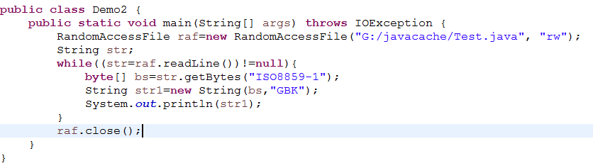

<h2>Table of Contents</h2>

<ul>
<li><a href="#sec-1">1. 随机读取流：</a>
<ul>
<li><a href="#sec-1-1">1.1. 简述：</a></li>
<li><a href="#sec-1-2">1.2. 使用</a></li>
<li><a href="#sec-1-3">1.3. rw功能：</a></li>
<li><a href="#sec-1-4">1.4. r功能：</a></li>
<li><a href="#sec-1-5">1.5. 解决中文乱码：</a></li>
</ul>
</li>
</ul>

# 随机读取流：

## 简述：

-   既能读，也能写
-   能直接操作多种类型数据
-   可以操作文件的任意位置。

## 使用

-   使用random流
    
        RandomAccessFile ran=new RandomAccessFile("路径","mode");
    
    <table border="2" cellspacing="0" cellpadding="6" rules="groups" frame="hsides">
    
    
    <colgroup>
    <col  class="left" />
    
    <col  class="left" />
    
    <col  class="left" />
    </colgroup>
    <tbody>
    <tr>
    <td class="left">mode:</td>
    <td class="left">r</td>
    <td class="left">rw</td>
    </tr>
    </tbody>
    </table>

## rw功能：

-   重载了各种数据类型的write。
    
        ran.write();
-   关闭流
    
        ran.close();
-   跳到指定的5位置开始写，覆盖原有内容
    
        ran.seek(5);
-   跳过10个字节进行操作
    
        ran.skipBytes(10);

## r功能：

-   一次读取一行。中文会乱码
    
        ran.readLine();
-   关闭流
    
        ran.close();
-   RandomAccessFile一般不用于处理文本文档：
    -   以下方法写入到文本文档中的64会被记事本显示为“    A”，因为int占4个字节。
        
            raf.writeInt(64);
    -   以下方法写入到文本文档中的boolean值会无法显示，因为记事本无法识别boolean字符。
        
            raf.writeBoolean(true);

## 解决中文乱码：

-   RandomAccessFile读取进来的字符是默认按照ISO8859-1进行编码的
-   主流的编码：
    
    <table border="2" cellspacing="0" cellpadding="6" rules="groups" frame="hsides">
    
    
    <colgroup>
    <col  class="left" />
    
    <col  class="left" />
    
    <col  class="left" />
    </colgroup>
    <tbody>
    <tr>
    <td class="left">UTF</td>
    <td class="left">UTF-8   UTF-16</td>
    <td class="left">世界编码</td>
    </tr>
    
    
    <tr>
    <td class="left">GBK</td>
    <td class="left">GB2312 GBK GBK18030</td>
    <td class="left">中国国标</td>
    </tr>
    
    
    <tr>
    <td class="left">ISO8859-1</td>
    <td class="left">ISO8859-1</td>
    <td class="left">西欧编码  不含中文</td>
    </tr>
    </tbody>
    </table>
-   处理中文字符乱码：
    
